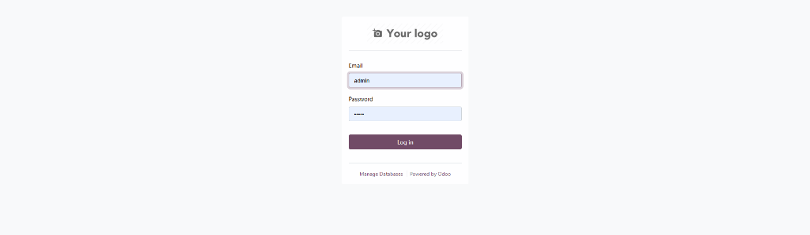
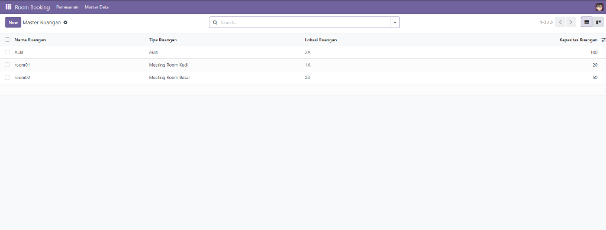
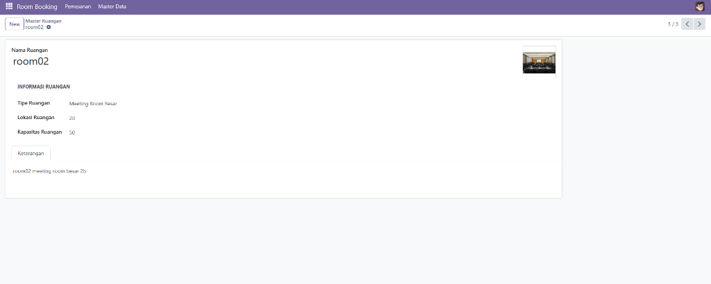
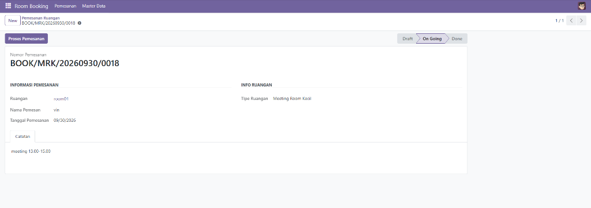
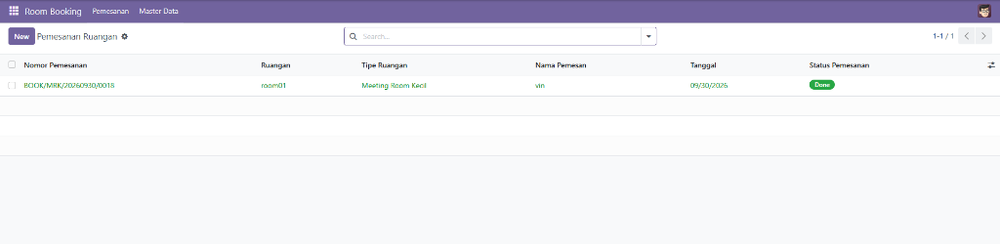

# Odoo Custom Module — Room Booking & Arithmetic Sequence

[](https://www.odoo.com)
[](https://www.python.org/)
[](https://www.postgresql.org/)
[](https://www.gnu.org/licenses/lgpl-3.0.html)

> Technical assessment: Odoo Development / System Engineer position.

---

## 1. Deskripsi Proyek (Project Description)

Repository ini berisi dua komponen utama:

| Komponen | Lokasi | Deskripsi |
|----------|--------|-----------|
| **Part 1 — Arithmetic Sequence** | `arithmetic_sequence/` | Script Python mandiri untuk menghasilkan deret aritmatika. |
| **Part 2 — Room Booking Module** | `custom_addons/room_booking/` | Modul kustom Odoo 17 untuk manajemen pemesanan ruangan. |

---

## 2. Business Requirements

### Part 1 — Arithmetic Sequence

- Menghasilkan deret aritmatika dengan suku pertama **a₁ = 2** dan beda **d = 3**.
- Formula: `a(n) = 2 + (n − 1) × 3`
- Menerima input **N** (jumlah suku), menangani input invalid.

### Part 2 — Room Booking

- **Master Ruangan** (`room.room`): Pendataan ruangan dengan nama unik, tipe, lokasi, foto, kapasitas, dan keterangan.
- **Pemesanan Ruangan** (`room.booking`): Pemesanan dengan nomor otomatis, validasi ketersediaan, dan alur status.
- **Validasi**:
  - Nama Ruangan harus unik.
  - Nama Pemesan harus unik.
  - Satu ruangan hanya dapat dipesan satu kali per hari.
  - Kapasitas tidak boleh negatif.
- **Workflow**: Draft → On Going → Done.

---

## 3. Features

### Arithmetic Sequence
- ✅ Fungsi `arithmetic_sequence(n)` menghasilkan deret sebagai list.
- ✅ Fungsi `format_sequence(n)` menghasilkan output sebagai string comma-separated.
- ✅ CLI interface: `python arithmetic_sequence.py <N>`.
- ✅ Validasi input: TypeError untuk non-integer, ValueError untuk n ≤ 0.
- ✅ 14 unit test cases.

### Room Booking Module
- ✅ Master Ruangan dengan tampilan List, Kanban (foto), dan Form.
- ✅ Pemesanan Ruangan dengan tampilan List (status badge), Form (statusbar), dan Search.
- ✅ Nomor pemesanan otomatis: `BOOK/{TIPE_RUANGAN}/{TANGGAL}/{SEQUENCE}`.
- ✅ Alur status dengan tombol **Proses Pemesanan**: Draft → On Going → Done.
- ✅ SQL constraint: unique room name, unique booking name, unique room+date.
- ✅ Python constraint: kapasitas tidak boleh negatif.
- ✅ Form fields menjadi readonly setelah status bukan Draft.
- ✅ 16 automated test cases.
- ✅ Docker Compose untuk environment development.

---

## 4. Odoo Version

| Komponen | Versi |
|----------|-------|
| **Odoo** | 17.0 (Community Edition) |
| **Python** | 3.10+ |
| **PostgreSQL** | 15 |

**Alasan pemilihan Odoo 17:**
- Versi LTS (Long Term Support) terbaru dengan dukungan resmi yang stabil.
- Menggunakan sintaks `invisible` baru (bukan `attrs`), sesuai standar Odoo 17+.
- Tersedia sebagai Docker image resmi.

---

## 5. Instalasi & Menjalankan

### Cara 1: Docker Compose (Direkomendasikan)

```bash
# 1. Clone repository
git clone https://github.com/vincentjiu23/odoo-custom-module.git
cd odoo-custom-module

# 2. Jalankan Odoo + PostgreSQL
docker compose up -d

# 3. Buka browser
# http://localhost:8069
```

Setelah Odoo berjalan:
1. Buat database baru (Master Password: `admin_master_secret`).
2. Login sebagai Administrator.
3. Aktifkan **Developer Mode** (Settings → General Settings → scroll bawah → Developer Tools → Activate Developer Mode).
4. Buka menu **Apps** → klik **Update Apps List**.
5. Cari **"Room Booking"** → klik **Activate / Install**.

### Cara 2: Instance Odoo Lokal

```bash
# Tambahkan path custom_addons ke odoo.conf:
addons_path = /path/to/odoo/addons,/path/to/repo/custom_addons

# Restart Odoo
./odoo-bin -c odoo.conf -u room_booking
```

### Menjalankan Arithmetic Sequence

```bash
cd arithmetic_sequence

# Contoh penggunaan
python arithmetic_sequence.py 4
# Output: 2,5,8,11

python arithmetic_sequence.py 7
# Output: 2,5,8,11,14,17,20
```

---

## 6. Cara Penggunaan & Tangkapan Layar (Screenshots)

### Halaman Login
Setelah database dibuat, akses halaman login Odoo pada [http://localhost:8069](http://localhost:8069):



### Master Ruangan (`room.room`)

1. Buka menu **Room Booking** → **Master Data** → **Master Ruangan**.
2. Klik **New** untuk menambah ruangan baru.
3. Isi semua field yang wajib:
   - **Nama Ruangan** (harus unik)
   - **Tipe Ruangan** (Meeting Room Kecil / Meeting Room Besar / Aula)
   - **Lokasi Ruangan** (1A, 1B, 1C, 2A, 2B, 2C)
   - **Foto Ruangan** (upload gambar)
   - **Kapasitas Ruangan** (angka ≥ 0)
4. Klik **Save**.
5. Gunakan tampilan **List** atau **Kanban** untuk melihat data ruangan.

**Tampilan Daftar Master Ruangan (List View):**


**Tampilan Detail Master Ruangan (Form View):**


---

### Membuat Pemesanan Ruangan (`room.booking`)

1. Buka menu **Room Booking** → **Pemesanan** → **Pemesanan Ruangan**.
2. Klik **New**.
3. Isi field yang wajib:
   - **Ruangan** (pilih dari Master Ruangan yang sudah dibuat)
   - **Nama Pemesan** (harus unik)
   - **Tanggal Pemesanan**
4. Klik **Save** — Nomor Pemesanan otomatis terisi dengan format `BOOK/{TIPE}/{YYYYMMDD}/{SEQUENCE}`.

### Alur Status (Workflow)

```
┌─────────┐    Proses     ┌──────────┐    Proses     ┌────────┐
│  Draft  │ ──────────▶  │ On Going │ ──────────▶  │  Done  │
└─────────┘   Pemesanan   └──────────┘   Pemesanan   └────────┘
```

- Klik tombol **"Proses Pemesanan"** untuk memajukan status:
  - Dari **Draft** menjadi **On Going** (fields otomatis menjadi readonly).
  - Dari **On Going** menjadi **Done** (tombol proses pemesanan disembunyikan).

**Tampilan Form Pemesanan Ruangan (Status: On Going):**


**Tampilan Daftar Pemesanan Ruangan (Status: Done):**


### Mencari Pemesanan

Gunakan **Search View** untuk mencari berdasarkan:
- Nomor Pemesanan
- Ruangan
- Nama Pemesan
- Status (filter: Draft, On Going, Done)
- Tanggal (filter: Hari Ini)

---

## 7. Validasi & Business Rules

| Rule | Implementasi | Pesan Error |
|------|-------------|-------------|
| Nama Ruangan unik | `_sql_constraints` UNIQUE(name) | "Nama Ruangan sudah ada!" |
| Kapasitas ≥ 0 | `@api.constrains('capacity')` | "Kapasitas Ruangan tidak boleh bernilai negatif." |
| Nama Pemesan unik | `_sql_constraints` UNIQUE(booking_name) | "Nama Pemesan sudah terdaftar!" |
| 1 ruangan = 1 booking/hari | `_sql_constraints` UNIQUE(room_id, booking_date) | "Ruangan sudah dipesan pada tanggal tersebut!" |
| Done tidak bisa diproses | `action_process()` raises `UserError` | "Pemesanan dengan status 'Done' tidak dapat diproses lagi." |

---

## 8. Format Nomor Pemesanan

### Ambiguitas

Assessment menyebutkan bahwa nomor pemesanan harus mengandung: **tipe pemesanan**, **tipe ruangan**, **tanggal**, dan **sequence** — namun format pastinya tidak ditentukan secara eksplisit.

### Keputusan Desain

Format yang diimplementasikan:

```
BOOK/{KODE_TIPE_RUANGAN}/{YYYYMMDD}/{SEQUENCE}
```

| Komponen | Keterangan | Contoh |
|----------|-----------|--------|
| `BOOK` | Prefiks tetap (tipe pemesanan: booking) | `BOOK` |
| Kode Tipe | `MRK` = Meeting Room Kecil, `MRB` = Meeting Room Besar, `AUL` = Aula | `MRK` |
| Tanggal | Format YYYYMMDD dari tanggal pemesanan | `20260930` |
| Sequence | 4-digit running number dari `ir.sequence` | `0001` |

**Contoh lengkap:** `BOOK/MRK/20260930/0001`

### Catatan Teknis
- Nomor dibuat saat record di-`create()`, bukan saat disimpan pertama kali.
- Sequence bersifat global (tidak reset per hari atau per tipe ruangan) untuk menjamin keunikan.
- `ir.sequence` didefinisikan di `data/sequence.xml`.

---

## 9. Testing

### Arithmetic Sequence Tests

```bash
cd arithmetic_sequence
python -m unittest test_arithmetic_sequence -v
```

Test cases:
| # | Test | Expected |
|---|------|----------|
| 1 | N = 1 | `[2]` |
| 2 | N = 4 | `[2, 5, 8, 11]` |
| 3 | N = 7 | `[2, 5, 8, 11, 14, 17, 20]` |
| 4 | N = 0 | `ValueError` |
| 5 | Negative N | `ValueError` |
| 6 | String input | `TypeError` |
| 7 | Float input | `TypeError` |
| 8 | Boolean input | `TypeError` |

### Room Booking Tests

```bash
# Dari dalam container Docker:
docker compose exec web odoo --test-tags /room_booking \
  -d test_db -i room_booking --stop-after-init

# Atau jika menjalankan Odoo secara lokal:
./odoo-bin --test-tags /room_booking \
  -d test_db -i room_booking --stop-after-init
```

Test cases:
| # | Test | Model | Assertion |
|---|------|-------|-----------|
| 1 | Create valid room | `room.room` | Room created with correct data |
| 2 | Duplicate room name | `room.room` | Exception raised |
| 3 | Negative capacity | `room.room` | `ValidationError` |
| 4 | Zero capacity allowed | `room.room` | No error (requirement says "negative") |
| 5 | Create valid booking | `room.booking` | Booking created successfully |
| 6 | Default status = Draft | `room.booking` | `status == 'draft'` |
| 7 | Draft → On Going | `room.booking` | `status == 'ongoing'` |
| 8 | On Going → Done | `room.booking` | `status == 'done'` |
| 9 | Done → error | `room.booking` | `UserError` raised |
| 10 | Same room + same date | `room.booking` | Exception raised |
| 11 | Same room + different date | `room.booking` | Both bookings valid |
| 12 | Different room + same date | `room.booking` | Both bookings valid |
| 13 | Duplicate booking name | `room.booking` | Exception raised |
| 14 | Booking number format | `room.booking` | Starts with `BOOK/MRK/YYYYMMDD/` |
| 15 | Room type codes | `room.booking` | MRB, AUL codes in number |
| 16 | Number ≠ 'New' | `room.booking` | `name != 'New'` |

---

## 10. Struktur Direktori

```
odoo-custom-module/
├── .gitignore
├── README.md
├── docker-compose.yml
├── odoo.conf
├── requirements.txt
│
├── docs/                           # Dokumentasi & Screenshot Pengujian
│   └── screenshots/
│       ├── 01_odoo_login.png
│       ├── 02_master_ruangan_list.png
│       ├── 03_master_ruangan_form.png
│       ├── 04_pemesanan_ruangan_form_ongoing.png
│       └── 05_pemesanan_ruangan_list_done.png
│
├── arithmetic_sequence/            # Part 1 — Arithmetic Sequence
│   ├── arithmetic_sequence.py      # Implementasi dan CLI
│   └── test_arithmetic_sequence.py # Unit tests
│
└── custom_addons/
    └── room_booking/               # Part 2 — Odoo Module
        ├── __init__.py
        ├── __manifest__.py
        │
        ├── models/
        │   ├── __init__.py
        │   ├── room.py             # room.room (Master Ruangan)
        │   └── booking.py          # room.booking (Pemesanan Ruangan)
        │
        ├── views/
        │   ├── room_views.xml      # List, Kanban, Form, Search views
        │   ├── booking_views.xml   # List, Form, Search views
        │   └── menu_views.xml      # Menu definitions
        │
        ├── security/
        │   └── ir.model.access.csv # Access control list
        │
        ├── data/
        │   └── sequence.xml        # ir.sequence for booking number
        │
        ├── tests/
        │   ├── __init__.py
        │   └── test_room_booking.py
        │
        └── static/
            └── description/
                └── icon.png
```

---

## 11. Requirements Traceability Matrix

| # | Requirement | Implementation | File | Test |
|---|-------------|---------------|------|------|
| 1 | Arithmetic sequence a(n) = 2+(n-1)*3 | `arithmetic_sequence()` function | `arithmetic_sequence/arithmetic_sequence.py` | `test_arithmetic_sequence.py` |
| 2 | Handle invalid N (0, negative, non-int) | TypeError / ValueError | `arithmetic_sequence.py` | `test_n_equals_0`, `test_negative_input`, `test_string_input` |
| 3 | Master Ruangan: 6 fields | `room.room` model with all fields | `models/room.py` | `test_01_create_valid_room` |
| 4 | Nama Ruangan harus unik | `_sql_constraints` UNIQUE(name) | `models/room.py` | `test_02_duplicate_room_name_rejected` |
| 5 | Kapasitas ≥ 0 | `@api.constrains('capacity')` | `models/room.py` | `test_03_negative_capacity_rejected` |
| 6 | Foto Ruangan required | `fields.Image(required=True)` | `models/room.py` | (implicitly via room creation) |
| 7 | Room views: List, Kanban, Form | XML views defined | `views/room_views.xml` | (UI — manual verification) |
| 8 | Pemesanan: 6 fields | `room.booking` model with all fields | `models/booking.py` | `test_01_create_valid_booking` |
| 9 | Nomor Pemesanan auto-generated | Override `create()` with ir.sequence | `models/booking.py` | `test_10_booking_number_format` |
| 10 | Booking number format BOOK/TYPE/DATE/SEQ | `ROOM_TYPE_CODE_MAP` + `create()` | `models/booking.py` | `test_10_*`, `test_11_*` |
| 11 | Default status = Draft | `default='draft'` | `models/booking.py` | `test_02_booking_default_status_draft` |
| 12 | Draft → On Going | `action_process()` | `models/booking.py` | `test_03_draft_to_ongoing` |
| 13 | On Going → Done | `action_process()` | `models/booking.py` | `test_04_ongoing_to_done` |
| 14 | Done → cannot process | `action_process()` raises UserError | `models/booking.py` | `test_05_done_cannot_process` |
| 15 | Same room + same date = rejected | `_sql_constraints` UNIQUE(room_id, booking_date) | `models/booking.py` | `test_06_same_room_same_date_rejected` |
| 16 | Same room + diff date = OK | No constraint blocks this | `models/booking.py` | `test_07_same_room_different_date_allowed` |
| 17 | Diff room + same date = OK | Constraint is per room_id | `models/booking.py` | `test_08_different_room_same_date_allowed` |
| 18 | Nama Pemesan unik | `_sql_constraints` UNIQUE(booking_name) | `models/booking.py` | `test_09_duplicate_booking_name_rejected` |
| 19 | Booking views: List, Form, Search | XML views defined | `views/booking_views.xml` | (UI — manual verification) |
| 20 | Search by: nomor, ruangan, nama, status | Search fields and filters | `views/booking_views.xml` | (UI — manual verification) |
| 21 | Statusbar in form | `widget="statusbar"` | `views/booking_views.xml` | (UI — manual verification) |
| 22 | Proses Pemesanan button | `<button name="action_process">` | `views/booking_views.xml` | (UI — manual verification) |
| 23 | Button hidden when Done | `invisible="status == 'done'"` | `views/booking_views.xml` | (UI — manual verification) |
| 24 | Security access | `ir.model.access.csv` | `security/ir.model.access.csv` | (installed via module data) |
| 25 | Docker environment | `docker-compose.yml` + `odoo.conf` | root level | (manual verification) |
| 26 | Menu access | Menu items defined | `views/menu_views.xml` | (UI — manual verification) |

---

## 12. Design Decisions & Assumptions

### Odoo Version
- **Odoo 17.0 Community** dipilih karena merupakan versi LTS terbaru yang stabil dan tersedia sebagai Docker image resmi.

### Module Dependencies
- Hanya bergantung pada `base` — tidak menambahkan `mail` atau modul lain karena assessment tidak mensyaratkan chatter/activity tracking. Ini menjaga modul tetap sederhana.

### Constraint Strategy
- **SQL constraints** (`_sql_constraints`) digunakan untuk aturan uniqueness karena enforcement di level database lebih aman dan performant.
- **Python constraints** (`@api.constrains`) digunakan untuk validasi value (kapasitas negatif) karena memungkinkan pesan error yang lebih kontekstual.

### Nama Pemesan (Booking Name) Uniqueness
- Assessment menyatakan "Nama Pemesanan / Nama Pemesan" harus unik. Field ini diinterpretasikan sebagai **nama/label pemesanan** (bukan nama orang yang memesan). Jika dimaksud sebagai nama orang, constraint ini akan membatasi satu orang hanya bisa membuat satu booking total — yang mungkin perlu didiskusikan dengan Product Owner.

### Kapasitas Nol
- Requirement hanya menyebutkan "tidak boleh negatif", sehingga **kapasitas 0 diizinkan**. Jika diperlukan minimum 1, tinggal ubah `< 0` menjadi `<= 0` pada constraint.

### Booking Number — Sequence Global
- Running number (sequence) bersifat **global** dan tidak di-reset per hari atau per tipe ruangan. Ini memastikan nomor pemesanan selalu unik tanpa race condition, yang merupakan pendekatan standar di Odoo.

### Form Readonly
- Field pemesanan (ruangan, nama pemesan, tanggal) menjadi **readonly** setelah status bukan Draft. Ini mencegah perubahan data setelah pemesanan diproses.

---

## 13. Potential Interview Questions

1. **Mengapa menggunakan `_sql_constraints` alih-alih `@api.constrains` untuk uniqueness?**
   > SQL constraints di-enforce di level database, memberikan jaminan integritas data yang lebih kuat bahkan saat ada akses langsung ke database. Juga lebih performant karena database yang menangani validasi.

2. **Bagaimana jika nomor pemesanan perlu di-reset per tahun?**
   > Bisa menggunakan `ir.sequence` dengan `prefix = 'BOOK/%(year)s/'` dan mengaktifkan `use_date_range = True`. Namun ini akan mengubah format nomor karena prefix menjadi bagian dari sequence.

3. **Mengapa `action_process()` menggunakan satu method untuk semua transisi?**
   > Assessment secara eksplisit meminta satu tombol "Proses Pemesanan" yang memajukan status. Jika workflow lebih kompleks (misalnya ada approval), bisa dipecah menjadi method terpisah per transisi.

4. **Bagaimana menangani concurrent booking untuk ruangan yang sama?**
   > SQL UNIQUE constraint pada `(room_id, booking_date)` menjamin atomicity di level database. Jika dua user mencoba book ruangan yang sama pada tanggal yang sama secara bersamaan, yang kedua akan mendapat error.

5. **Mengapa modul tidak menggunakan `mail.thread`?**
   > Assessment tidak meminta fitur chatter/messaging. Menambahkannya akan memperkenalkan dependency tambahan dan meningkatkan kompleksitas tanpa memenuhi requirement yang diminta.

6. **Bagaimana jika pemesanan perlu di-cancel?**
   > Saat ini tidak ada status 'Cancelled'. Jika diperlukan, bisa ditambahkan state baru dan button terpisah `action_cancel()`. Atau bisa menggunakan field `active` untuk soft-delete.

---

## 14. Penulis & Lisensi

- **Penulis**: Vincent Jiu ([@vincentjiu23](https://github.com/vincentjiu23))
- **Email**: vincentjius@gmail.com
- **Lisensi**: LGPL-3 (GNU Lesser General Public License v3.0)
